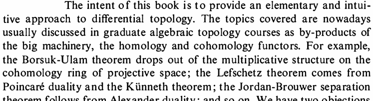

#+TITLE: Sublevel sets of the CATE function
#+Author: Anders Munch
#+Date: \today

#+PROPERTY: header-args:R :async :results silent  :exports results  :session *R* :cache yes

* COMMENT Notes

- Rough and raw ideas
- Tell me if it does not make sense -- or if it has already been done

* Motivation

The average treatment effect provides a (too) simple summary of how a
treatment works in a population.

\vfill

Interest in investigating heterogeneity in treatment effects (and
finding subpopulations with different treatment effects).

\vfill

Active research area on estimating the conditional average treatment
effect (CATE).

\vfill

The CATE function is a complicated object, in particular when many
baseline covariates are recorded.

\vfill

Objective to estimate lower-dimensional /summaries/ or /features/ of
the CATE function which can be visualized and interpreted.

* Formal setup

#+begin_export latex
\( (Y^1, Y^0, W) \sim Q \), \( Y^a \) counterfactual binary outcome
under treatment levels \( a \in \{0,1\} \),
$ W \in \mathcal{W} \subset \R^d$.

\vfill

The CATE function is \(   w \mapsto \E_Q{\left[ Y^1 - Y^0 \mid W=w \right]} \).

\vfill

We observe \( O = (W, A, Y) \sim P \) where \( A \in \{0,1\} \) is the
actually given treatment and \( Y= Y^1 A + Y^0 (1-A) \).

\vfill

Under standard causal assumption, the function-valued parameter $\tau$
defined as
\begin{equation*}
  \tau(P)(w) = \E_P{[Y \mid A=1, W=w]} - \E_P{[Y \mid A=0, W=w]} 
\end{equation*}
identifies the CATE function.
#+end_export

* Idea: Study the area of the sublevel sets of $\tau$

\vspace{.5cm}

#+begin_export latex
The (sub)level set of the function
$\tau(P) \colon \mathcal{W} \rightarrow \R$ for level
$\alpha \in [-1,1]$ is 
\begin{equation*}
  \mathcal{W}_{\alpha}(P) = \{ w \in W : \tau(P)(w) \leq \alpha\}.
\end{equation*}
#+end_export

#+BEGIN_SRC R :results silent
    ff <-  function(x) {
      0.6 * dnorm(x, mean = -2, sd = 0.8) + 
      0.2 * dnorm(x, mean = 1, sd = 0.9)
    }
    draw_sublevel <- function(alpha, xs = seq(-3, 3, length.out = 500)){
      plot(xs, ff(xs), type = "l", axes = F, xlab = "", ylab = "", ylim = c(0,0.3))
      abline(h = alpha, col = "blue", lty = 2)
      points(xs[ff(xs) < alpha],
	     rep(0, sum(ff(xs) < alpha)),
	     col = "blue",
	     pch = 19, cex = 0.5)

    }
#+END_SRC

\vspace{-1cm}

** overlay block 
:PROPERTIES:
:BEAMER_act: <1>
:BEAMER_env: onlyenv
:END:

#+BEGIN_SRC R :results graphics file :exports results :file "sublevel-set1.pdf" :height 4 :width 6

  draw_sublevel(0.05)

#+END_SRC

#+RESULTS:
[[file:sublevel-set1.pdf]]

** overlay block 
:PROPERTIES:
:BEAMER_act: <2>
:BEAMER_env: onlyenv
:END:

#+BEGIN_SRC R :results graphics file :exports results :file "sublevel-set2.pdf" :height 4 :width 6

  draw_sublevel(0.07)

#+END_SRC

#+RESULTS:
[[file:sublevel-set2.pdf]]

** overlay block 
:PROPERTIES:
:BEAMER_act: <3>
:BEAMER_env: onlyenv
:END:

#+BEGIN_SRC R :results graphics file :exports results :file "sublevel-set3.pdf" :height 4 :width 6

  draw_sublevel(0.12)

#+END_SRC

#+RESULTS:
[[file:sublevel-set3.pdf]]

** overlay block 
:PROPERTIES:
:BEAMER_act: <4>
:BEAMER_env: onlyenv
:END:

#+BEGIN_SRC R :results graphics file :exports results :file "sublevel-set4.pdf" :height 4 :width 6

  draw_sublevel(0.2)

#+END_SRC

#+RESULTS:
[[file:sublevel-set4.pdf]]

* Estimand

#+begin_export latex
We consider the parameter \( \gamma \) defined as the function
\( \gamma(P) \colon [-1,1] \longrightarrow [0,1] \) with
\begin{equation*}
  \gamma(P)(\alpha) =
  P(\mathcal{W}_{\alpha}(P)) =
  P(\tau(P)(W) \leq \alpha).
\end{equation*}

\vfill

Alternative formulation is that $\gamma(P)$ is the cumulative
distribution function of the random variable
\( \tau(P)(W) \in [-1,1] \).
#+end_export

\vfill

Univariate, nondecreasing function which is easy to visualize.

\vfill

**                                                                  :B_quote:
:PROPERTIES:
:BEAMER_env: quote
:END:
The value \(
\gamma(P)(\alpha) \) is the proportion of the population with an
expected treatment effect below or equal to $\alpha$. For instance,
$\gamma(P)(0)$ is the proportion of the population for which the
treatment is not expected to be beneficial.

* Illustration of the function $\gamma(P) \colon [-1,1] \rightarrow [0,1]$

#+BEGIN_SRC R :results silent
  library(data.table)
  library(here)
  library(ranger)
  library(riskRegression)

  setwd(here("cate-sublevel-sets-biostat-jc"))

  sim_data <- function(n = 100000, Y_f = NULL, A_f = NULL){
    out = data.table(Age = rnorm(n),
		     ## FEV = runif(n),
		     Sex = 1*(runif(n)<0.3))
    if (!is.null(Y_f)) {
      if (!is.null(A_f)){
	out[, pi := A_f(Age,  Sex)]
	out[, A := rbinom(n, 1, pi)]
	out[, mu := Y_f(A, Age,  Sex)]
	out[, Y := rbinom(n, 1, mu)]
      }else{
	## Get CATE
	out[, cate := Y_f(1, Age,  Sex) - Y_f(0, Age,  Sex)]
      }
    }
    return(out)
  }

  make_gamma_plot <- function(cate, aa = seq(-1, 1, length = 2000)){
    cate = sort(cate)
    ff = sapply(aa, function(a) mean(cate < a))
    plot(aa, ff, type = "l", xlab = expression("Effect size " * (alpha)), ylab = expression("Size of levels set " * (gamma)), lwd = 2)
    abline(v = mean(cate), col = "gray", lty = 1, lwd = 2)
    text(x = mean(cate), y = .9, labels = "ATE", pos = 2, col = "gray")
  }

  expit <- function(x) 1/(1+exp(-x))

  cate2 <- function(A, Age,  Sex) expit(.1*Age-2*Age*A+Sex+2*Sex*A+0.4*A)
#+END_SRC

\hfill

** overlay block 
:PROPERTIES:
:BEAMER_act: <1>
:BEAMER_env: onlyenv
:END:

#+BEGIN_CENTER
\texttt{glm(Y $\sim$ age * A + sex)}
#+END_CENTER

\vspace{-1.2cm}

#+BEGIN_SRC R :results graphics file :exports results :file "curve-illu-v1.pdf" :height 4 :width 6
sim_data(
  Y_f = function(A, Age,  Sex) expit(.1*Age+Age*A+Sex+0.4*A)
)$cate |>
  make_gamma_plot()
#+END_SRC

#+RESULTS:
[[file:curve-illu-v1.pdf]]

** overlay block 
:PROPERTIES:
:BEAMER_act: <2>
:BEAMER_env: onlyenv
:END:

#+BEGIN_CENTER
\texttt{glm(Y $\sim$ age * A + sex * A)}
#+END_CENTER

\vspace{-1.2cm}

#+BEGIN_SRC R :results graphics file :exports results :file "curve-illu-v2.pdf" :height 4 :width 6
sim2 <- sim_data(Y_f = cate2)
make_gamma_plot(sim2$cate)
#+END_SRC

#+RESULTS:
[[file:curve-illu-v2.pdf]]

** overlay block 
:PROPERTIES:
:BEAMER_act: <3>
:BEAMER_env: onlyenv
:END:

#+BEGIN_CENTER
\texttt{glm(Y $\sim$ age + sex + A)}
#+END_CENTER

\vspace{-1.2cm}

#+BEGIN_SRC R :results graphics file :exports results :file "curve-illu-v3.pdf" :height 4 :width 6
sim_data(
  Y_f = function(A, Age,  Sex)
    expit(0.5*Age+Sex+A)
)$cate |>
  make_gamma_plot()
#+END_SRC

#+RESULTS:
[[file:curve-illu-v3.pdf]]

** overlay block 
:PROPERTIES:
:BEAMER_act: <4>
:BEAMER_env: onlyenv
:END:

#+BEGIN_CENTER
\texttt{glm(Y $\sim$ sex + A)}
#+END_CENTER

\vspace{-1.2cm}

#+BEGIN_SRC R :results graphics file :exports results :file "curve-illu-v4.pdf" :height 4 :width 6
sim_data(
  Y_f = function(A, Age,  Sex)
    expit(0*Age+Sex+A)
)$cate |>
  make_gamma_plot()
#+END_SRC

#+RESULTS:
[[file:curve-illu-v4.pdf]]

* Estimation

For fixed $\alpha \in (-1,1)$, the parameter \( P \mapsto
\gamma(P){(\alpha)} \) is not pathwise differentiable (under some
regularity conditions[fn:1]).

\vfill

Necessary condition for the existence of a
regular and asymptotically linear estimator
\citep{van1991differentiable}.

\vfill

\( \implies \) Usual toolbox not available.

** Footnotes
[fn:1] Led me to the book "Differential Topology"
\citep{guillemin2010differential}:
#+ATTR_LATEX: :width .7\textwidth

#  \center{\dots}

* Estimators

The standard toolbox is not available $\rightarrow$ many interesting
procedures to consider:

\vspace{.5cm}

- "Naive plug-in" estimator

- Generalized Grenander-type estimator

- Estimate a best approximating spline estimand

- Orthogonal statistical learning

\vfill

* Naive plug-in (i.e., the obvious) estimator

** overlay block 
:PROPERTIES:
:BEAMER_act: <1>
:BEAMER_env: onlyenv
:END:

#+BEGIN_SRC R :exports code :results silent
  glm_fit <- glm(Y ~ A*Age*Sex, data = sim_dd, family = binomial())

  wd0 <- copy(sim_dd)[, A := 0]
  wd1 <- copy(sim_dd)[, A := 1]

  Y1_hat <- predict(glm_fit, newdata = wd1, type = "response")
  Y0_hat <- predict(glm_fit, newdata = wd0, type = "response")
  est_cates <- Y1_hat - Y0_hat

  Fn <- ecdf(est_cates)
  plot(Fn)
#+END_SRC

** overlay block
:PROPERTIES:
:BEAMER_act: <2>
:BEAMER_env: onlyenv
:END:

#+BEGIN_SRC R :results graphics file :exports results :file "est-gamma-glm1.pdf" :height 5
  get_cate_est <- function(fit, data){
    wd0 = copy(data)[, A := 0]
    wd1 = copy(data)[, A := 1]
    cate = predictRisk(fit, newdata = wd1) - predictRisk(fit, newdata = wd0)
    return(as.numeric(cate))
  }

  make_est_gamma_plot <- function(true_cate, est_cate, aa = seq(-1, 1, length = 2000), add = FALSE,
				  col = "blue", lwd = 2, title=""){
    if (!add)
    {
      true_cate = sort(true_cate)
      ff = sapply(aa, function(a) mean(true_cate < a))
      plot(aa, ff, type = "l", xlab = expression("Effect size " * (alpha)), ylab = expression("Size of levels set " * (gamma)), lwd = lwd,
	   main=title)
    }
    Fn = ecdf(est_cate)
    lines(sort(est_cate), Fn(sort(est_cate)), type = "s", col = col, lwd = lwd)
  }

  set.seed(111)
  sim_dd <- sim_data(n = 500, Y_f = cate2, A_f = function(Age,Sex) 0.5)
  glm_fit <- glm(Y ~ A*Age*Sex, data = sim_dd, family = binomial())
  make_est_gamma_plot(true_cate = sim2$cate, est_cate = get_cate_est(glm_fit, sim_dd), title="Estimating with correctly specified glm")  
#+END_SRC

#+RESULTS:
[[file:est-gamma-glm1.pdf]]

** overlay block 
:PROPERTIES:
:BEAMER_act: <3>
:BEAMER_env: onlyenv
:END:

#+BEGIN_SRC R :results graphics file :exports results :file "est-gamma-glm2.pdf" :height 5
  make_est_gamma_plot(true_cate = sim2$cate, est_cate = get_cate_est(glm_fit, sim_dd),title="Estimating with correctly specified glm")
  set.seed(222)
  sapply(1:5, function(xx){
      sim_dd <- sim_data(n = 500, Y_f = cate2, A_f = function(Age,Sex) 0.5)
      glm_fit <- glm(Y ~ A*Age*Sex, data = sim_dd, family = binomial())
      make_est_gamma_plot(true_cate = sim2$cate, est_cate = get_cate_est(glm_fit, sim_dd),
			  add = TRUE, col = "lightblue", lwd = 1.5)
    })
#+END_SRC

#+RESULTS:
[[file:est-gamma-glm2.pdf]]

** overlay block 
:PROPERTIES:
:BEAMER_act: <4>
:BEAMER_env: onlyenv
:END:

#+BEGIN_SRC R :results graphics file :exports results :file "est-gamma-rf1.pdf" :height 5
  set.seed(333)
  rf_fit_all <- ranger(Y ~ A+Age+Sex, data = sim_dd, probability = TRUE)
  make_est_gamma_plot(true_cate = sim2$cate,
		      est_cate = get_cate_est(rf_fit_all, sim_dd),
		      title="Estimating with random forest",
		      col="orange") 
#+END_SRC

#+RESULTS:
[[file:est-gamma-rf1.pdf]]

** overlay block 
:PROPERTIES:
:BEAMER_act: <5>
:BEAMER_env: onlyenv
:END:

#+BEGIN_SRC R :results graphics file :exports results :file "est-gamma-rf2.pdf" :height 5
  make_est_gamma_plot(true_cate = sim2$cate,
		      est_cate = get_cate_est(rf_fit_all, sim_dd),
		      title="Estimating with random forest",
		      col = "orange")
  set.seed(444)
  sapply(1:5, function(xx){
    sim_dd <- sim_data(n = 500, Y_f = cate2, A_f = function(Age,Sex) 0.5)
    rf_fit <- ranger(Y ~ A+Age+Sex, data = sim_dd, probability = TRUE)
    make_est_gamma_plot(true_cate = sim2$cate, est_cate = get_cate_est(rf_fit, sim_dd),
			add = TRUE, col = "pink", lwd = 1.5)
  })
#+END_SRC

#+RESULTS:
[[file:est-gamma-rf2.pdf]]

* Orthogonal statistical learning \citep{foster2023orthogonal} :noexport:

** overlay block 
:PROPERTIES:
:BEAMER_act: <1>
:BEAMER_env: onlyenv
:END:

Adding an augmentation (from semi-parametric efficiency theory) leads
to an /Neyman orthogonal risk functional/.

#+BEGIN_SRC R :exports code
  treat_fit_glm <- glm(A ~ 1, data = sim_dd, family = binomial())

  pi_hat <- predict(treat_fit_glm, newdata = sim_dd, type = "response")
  ## pi_hat <- 0.5
  A <- sim_dd$A
  Y <- sim_dd$Y

  aug_term <- A/pi_hat*(Y - Y1_hat) - (1-A)/(1-pi_hat)*(Y - Y0_hat)

  true_m1 <- sim_dd[,cate2(1,Age,Sex)]
  true_m0 <- sim_dd[,cate2(0,Age,Sex)]

  true_aug_term <- A/0.5*(Y - true_m1) - (1-A)/(1-0.5)*(Y - true_m0)

  plot(aug_term, true_aug_term)

  true_cates_os <- true_m1 - true_m0 + true_aug_term

  est_cates_os <- est_cates + aug_term

  plot(true_cates_os, est_cates_os)

  plot(est_cates_os)

  plot(ecdf(est_cates_os))

  sim_data(n = 500, Y_f = cate2, A_f = function(Age,Sex) 0.5)[, hist(mu, breaks = 100)]
#+END_SRC

#+RESULTS:
#+begin_example
$breaks
  [1] 0.00 0.01 0.02 0.03 0.04 0.05 0.06 0.07 0.08 0.09 0.10 0.11 0.12 0.13 0.14 0.15 0.16 0.17 0.18 0.19 0.20 0.21 0.22
 [24] 0.23 0.24 0.25 0.26 0.27 0.28 0.29 0.30 0.31 0.32 0.33 0.34 0.35 0.36 0.37 0.38 0.39 0.40 0.41 0.42 0.43 0.44 0.45
 [47] 0.46 0.47 0.48 0.49 0.50 0.51 0.52 0.53 0.54 0.55 0.56 0.57 0.58 0.59 0.60 0.61 0.62 0.63 0.64 0.65 0.66 0.67 0.68
 [70] 0.69 0.70 0.71 0.72 0.73 0.74 0.75 0.76 0.77 0.78 0.79 0.80 0.81 0.82 0.83 0.84 0.85 0.86 0.87 0.88 0.89 0.90 0.91
 [93] 0.92 0.93 0.94 0.95 0.96 0.97 0.98 0.99 1.00

$counts
  [1]  1  2  4  0  2  3  2  0  0  0  3  3  3  2  2  3  2  3  0  0  3  3  1  1  2  2  2  2  3  0  2  0  2  0  3  1  2  1
 [39]  1  0  2  3  0  0  2  7 14 27 21 32 18 28 22  6  6  6  3  2  3  2  5  1  0  0  2  0  3  1  4  3  8 13 15 15 19 11
 [77]  7  2  2  3  1  5  1  0  1  2  2  3  6  6  4  4  6  2  5  5 15  8 21 19

$density
  [1] 0.2 0.4 0.8 0.0 0.4 0.6 0.4 0.0 0.0 0.0 0.6 0.6 0.6 0.4 0.4 0.6 0.4 0.6 0.0 0.0 0.6 0.6 0.2 0.2 0.4 0.4 0.4 0.4
 [29] 0.6 0.0 0.4 0.0 0.4 0.0 0.6 0.2 0.4 0.2 0.2 0.0 0.4 0.6 0.0 0.0 0.4 1.4 2.8 5.4 4.2 6.4 3.6 5.6 4.4 1.2 1.2 1.2
 [57] 0.6 0.4 0.6 0.4 1.0 0.2 0.0 0.0 0.4 0.0 0.6 0.2 0.8 0.6 1.6 2.6 3.0 3.0 3.8 2.2 1.4 0.4 0.4 0.6 0.2 1.0 0.2 0.0
 [85] 0.2 0.4 0.4 0.6 1.2 1.2 0.8 0.8 1.2 0.4 1.0 1.0 3.0 1.6 4.2 3.8

$mids
  [1] 0.005 0.015 0.025 0.035 0.045 0.055 0.065 0.075 0.085 0.095 0.105 0.115 0.125 0.135 0.145 0.155 0.165 0.175 0.185
 [20] 0.195 0.205 0.215 0.225 0.235 0.245 0.255 0.265 0.275 0.285 0.295 0.305 0.315 0.325 0.335 0.345 0.355 0.365 0.375
 [39] 0.385 0.395 0.405 0.415 0.425 0.435 0.445 0.455 0.465 0.475 0.485 0.495 0.505 0.515 0.525 0.535 0.545 0.555 0.565
 [58] 0.575 0.585 0.595 0.605 0.615 0.625 0.635 0.645 0.655 0.665 0.675 0.685 0.695 0.705 0.715 0.725 0.735 0.745 0.755
 [77] 0.765 0.775 0.785 0.795 0.805 0.815 0.825 0.835 0.845 0.855 0.865 0.875 0.885 0.895 0.905 0.915 0.925 0.935 0.945
 [96] 0.955 0.965 0.975 0.985 0.995

$xname
[1] "mu"

$equidist
[1] TRUE

attr(,"class")
[1] "histogram"
#+end_example

** overlay block 
:PROPERTIES:
:BEAMER_act: <2>
:BEAMER_env: onlyenv
:END:

#+BEGIN_SRC R
  get_cate_est_one_step <- function(out_fit, treat_fit, data){

    wd0 = copy(data)[, A := 0]
    wd1 = copy(data)[, A := 1]

    mu1 = predictRisk(out_fit,
		  newdata = wd1)
    mu0 = predictRisk(out_fit,
		  newdata = wd0)

    pi_hat = predict(treat_fit, newdata = data, type = "response")
    A = data$A
    Y = data$Y

    out = as.numeric(
      mu1 + data$A/pi_hat*(data$Y - mu1) -
      (mu0 + (1-data$A)/(1-pi_hat)*(data$Y - mu0))
    )

    return(out)
  }

  treat_fit_glm <- glm(A ~ Sex, data = sim_dd, family = binomial())

#+END_SRC

#+RESULTS:

#+BEGIN_SRC R :results graphics file :exports results :file "one-step-cate-glm1.pdf" :height 5
  make_est_gamma_plot(true_cate = sim2$cate, est_cate = get_cate_est(glm_fit, sim_dd), title="Compare plug-in and orthogonal learner based on GLM")
  make_est_gamma_plot(est_cate = get_cate_est_one_step(glm_fit, treat_fit_glm, sim_dd), add = TRUE, col = "green")
#+END_SRC

#+RESULTS:
[[file:one-step-cate-glm1.pdf]]

** overlay block 
:PROPERTIES:
:BEAMER_act: <3>
:BEAMER_env: onlyenv
:END:

#+BEGIN_SRC R :results graphics file :exports results :file "one-step-cate-glm2.pdf" :height 5
  make_est_gamma_plot(true_cate = sim2$cate, est_cate = get_cate_est(glm_fit, sim_dd), title="Compare plug-in and orthogonal learner based on GLM")
  make_est_gamma_plot(est_cate = get_cate_est_one_step(glm_fit, treat_fit_glm, sim_dd), add = TRUE, col = "green")
  set.seed(222)
  sapply(1:5, function(xx){
    sim_dd <- sim_data(n = 500, Y_f = cate2, A_f = function(Age,Sex) 0.5)
    glm_fit <- glm(Y ~ A*Age*Sex, data = sim_dd, family = binomial())
    make_est_gamma_plot(true_cate = sim2$cate, est_cate = get_cate_est(glm_fit, sim_dd),
			add = TRUE, col = "lightblue", lwd = 1)
    make_est_gamma_plot(true_cate = sim2$cate, est_cate = get_cate_est_one_step(glm_fit, treat_fit_glm, sim_dd),
			add = TRUE, col = "lightgreen", lwd = 1)
  })
#+END_SRC

#+RESULTS:
[[file:one-step-cate-glm2.pdf]]

** overlay block 
:PROPERTIES:
:BEAMER_act: <4>
:BEAMER_env: onlyenv
:END:

#+BEGIN_SRC R :results graphics file :exports results :file "one-step-cate-rf1.pdf" :height 5
  make_est_gamma_plot(true_cate = sim2$cate, est_cate = get_cate_est(rf_fit_all, sim_dd), title="Compare plug-in and orthogonal learner based on random forest", col = "orange")
  make_est_gamma_plot(est_cate = get_cate_est_one_step(rf_fit_all, treat_fit_glm, sim_dd), add = TRUE, col = "green")
#+END_SRC

#+RESULTS:
[[file:one-step-cate-rf1.pdf]]

** overlay block 
:PROPERTIES:
:BEAMER_act: <5>
:BEAMER_env: onlyenv
:END:

#+BEGIN_SRC R :results graphics file :exports results :file "one-step-cate-rf2.pdf" :height 5
  make_est_gamma_plot(true_cate = sim2$cate, est_cate = get_cate_est(rf_fit_all, sim_dd), title="Compare plug-in and orthogonal learner based on random forest", col = "orange")
  make_est_gamma_plot(est_cate = get_cate_est_one_step(rf_fit_all, treat_fit_glm, sim_dd), add = TRUE, col = "green")
  set.seed(444)
  sapply(1:5, function(xx){
      sim_dd <- sim_data(n = 500, Y_f = cate2, A_f = function(Age,Sex) 0.5)
      rf_fit <- ranger(Y ~ A+Age+Sex, data = sim_dd, probability = TRUE)
      make_est_gamma_plot(true_cate = sim2$cate, est_cate = get_cate_est(rf_fit, sim_dd),
			  add = TRUE, col = "pink", lwd = 1.5)
      make_est_gamma_plot(true_cate = sim2$cate, est_cate = get_cate_est_one_step(rf_fit, treat_fit_glm, sim_dd),
			  add = TRUE, col = "lightgreen", lwd = 1)
    })
#+END_SRC

#+RESULTS:
[[file:one-step-cate-rf2.pdf]]

* Generalized Grenander-type estimator[fn:2]

The function $\alpha \mapsto \gamma(P)(\alpha)$ is nondecreasing. The
primitive of a nondecreasing function is convex.

\vfill

\color{bblue}Idea\color{black}:
1. Estimate the primitive function (aka anti-derivative) \(     \alpha \mapsto \Gamma(P)(\alpha) = \int_{-1}^{\alpha} \gamma(P)(u)
   \diff u \)
2. Find the greatest greatest convex minorant of the estimator
   $\hat\Gamma_n$
3. Estimate $\gamma$ with the derivative of $\hat\Gamma_n$

\vfill

The parameter \( P \mapsto \Gamma(P)(\alpha) \) /is/ pathwise
differentiable at points $\alpha$ at which $\alpha \mapsto
\gamma(P)(\alpha)$ is continuous.

\vfill

We can use the standard toolbox to estimate \( \Gamma(P) \).

** Footnotes   
[fn:2]\cite{westling2020unified,van2006estimating,groeneboom1983density,grenander1956theory}

* Approximate estimand
\vfill

Estimate an approximation of the function \( \gamma(P) \), e.g., the
best 0- or 1-order spline approximation to \( \gamma(P) \).

\vfill

Splines (with fixed knots) are determined by a set of coefficients.
These coefficient are pathwise differentiable, if the knots are not
placed at points of discontinuity of \( \alpha \mapsto
\gamma(P)(\alpha) \).

\vfill

* Orthogonal statistical learning \citep{foster2023orthogonal}

Extending some of the ideas from the debiased machine learning
literature to more general /statistical learning/ -- estimating
function with empirical loss minimization.

* Challenges

\vfill

- Not clear how incorporate the very interesting special case that
  $\alpha \mapsto \gamma(P)(\alpha)$ is the CDF of a Dirac measure =
  no heterogeneity.

\vfill

- Inference

\vfill

* Next project

The function $\gamma$ can be used to visually investigate if there is
any treatment heterogeneity in the population.

\vfill

But it does not tell us who the people are that respond differently.

\vfill

Approximate the levels sets \( \mathcal{W}_{\alpha}(P) \) with boxes
for suitable choices of $\alpha$ to identify subgroups that can be
expected to respond differently to treatment.

* References
\footnotesize \bibliography{bib.bib}

* HEADER :noexport:
#+LANGUAGE:  en
#+OPTIONS:   H:1 num:t toc:nil ':t ^:t
#+startup: beamer
#+LaTeX_CLASS: beamer
#+LATEX_CLASS_OPTIONS: [smaller, aspectratio=169]
#+LaTeX_HEADER: \usepackage{natbib, dsfont, pgfpages, tikz,amssymb, amsmath,xcolor}
#+LaTeX_HEADER: \bibliographystyle{abbrvnat}
#+BIBLIOGRAPHY: bib plain

# Beamer settins:
# #+LaTeX_HEADER: \usefonttheme[onlymath]{serif} 
#+LaTeX_HEADER: \setbeamertemplate{footline}[frame number]
#+LaTeX_HEADER: \beamertemplatenavigationsymbolsempty
#+LaTeX_HEADER: \usepackage{appendixnumberbeamer}
#+LaTeX_HEADER: \setbeamercolor{gray}{bg=white!90!black}
#+COLUMNS: %40ITEM %10BEAMER_env(Env) %9BEAMER_envargs(Env Args) %4BEAMER_col(Col) %10BEAMER_extra(Extra)
#+LATEX_HEADER: \setbeamertemplate{itemize items}{$\circ$}
#+LaTeX_HEADER: \renewcommand{\thefootnote}{\fnsymbol{footnote}}

# Setting size of code block
# #+LaTeX_HEADER: \lstset{basicstyle=\ttfamily\footnotesize}
# Using when output of code is verbatim
#+LATEX_HEADER: \RequirePackage{fancyvrb}
#+LATEX_HEADER: \DefineVerbatimEnvironment{verbatim}{Verbatim}{fontsize=\footnotesize}

# Matching beamer blue color
#+LaTeX_HEADER: \definecolor{bblue}{rgb}{0.2,0.2,0.7}

# For handout mode: (check order...)
# #+LATEX_CLASS_OPTIONS: [handout]
# #+LaTeX_HEADER: \pgfpagesuselayout{4 on 1}[border shrink=1mm]
# #+LaTeX_HEADER: \pgfpageslogicalpageoptions{1}{border code=\pgfusepath{stroke}}
# #+LaTeX_HEADER: \pgfpageslogicalpageoptions{2}{border code=\pgfusepath{stroke}}
# #+LaTeX_HEADER: \pgfpageslogicalpageoptions{3}{border code=\pgfusepath{stroke}}
# #+LaTeX_HEADER: \pgfpageslogicalpageoptions{4}{border code=\pgfusepath{stroke}}

# Common command
#+LaTeX_HEADER: \newcommand{\E}{{\ensuremath{\mathop{{\mathbb{E}}}}}} 
#+LaTeX_HEADER: \newcommand{\R}{\mathbb{R}}
#+LaTeX_HEADER: \newcommand{\N}{\mathbb{N}}
#+LaTeX_HEADER: \newcommand{\blank}{\makebox[1ex]{\textbf{$\cdot$}}}
#+LaTeX_HEADER: \newcommand\independent{\protect\mathpalette{\protect\independenT}{\perp}}
#+LaTeX_HEADER: \def\independenT#1#2{\mathrel{\rlap{$#1#2$}\mkern2mu{#1#2}}}
#+LaTeX_HEADER: \renewcommand{\phi}{\varphi}
#+LaTeX_HEADER: \renewcommand{\epsilon}{\varepsilon}
#+LaTeX_HEADER: \newcommand*\diff{\mathop{}\!\mathrm{d}}
#+LaTeX_HEADER: \newcommand{\weakly}{\rightsquigarrow}
#+LaTeX_HEADER: \newcommand\smallO{\textit{o}}
#+LaTeX_HEADER: \newcommand\bigO{\textit{O}}
#+LaTeX_HEADER: \newcommand{\midd}{\; \middle|\;}
#+LaTeX_HEADER: \newcommand{\1}{\mathds{1}}
#+LaTeX_HEADER: \usepackage{ifthen} %% Empirical process with default argument
#+LaTeX_HEADER: \newcommand{\G}[2][n]{{\ensuremath{\mathbb{G}_{#1}}{\left[#2\right]}}}
#+LaTeX_HEADER: \DeclareMathOperator*{\argmin}{\arg\!\min}
#+LaTeX_HEADER: \DeclareMathOperator*{\argmax}{\arg\!\max}
#+LaTeX_HEADER: \newcommand{\V}{\mathrm{Var}} % variance
#+LaTeX_HEADER: \newcommand{\eqd}{\stackrel{d}{=}} % equality in distribution
#+LaTeX_HEADER: \newcommand{\arrow}[1]{\xrightarrow{\; {#1} \;}}
#+LaTeX_HEADER: \newcommand{\arrowP}{\xrightarrow{\; P \;}} % convergence in probability
#+LaTeX_HEADER: \newcommand{\KL}{\ensuremath{D_{\mathrm{KL}}}}
#+LaTeX_HEADER: \newcommand{\leb}{\lambda} % the Lebesgue measure
#+LaTeX_HEADER: \DeclareMathOperator{\TT}{\Psi} % target parameter
#+LaTeX_HEADER: \newcommand{\empmeas}{\ensuremath{\mathbb{P}_n}} % empirical measure
