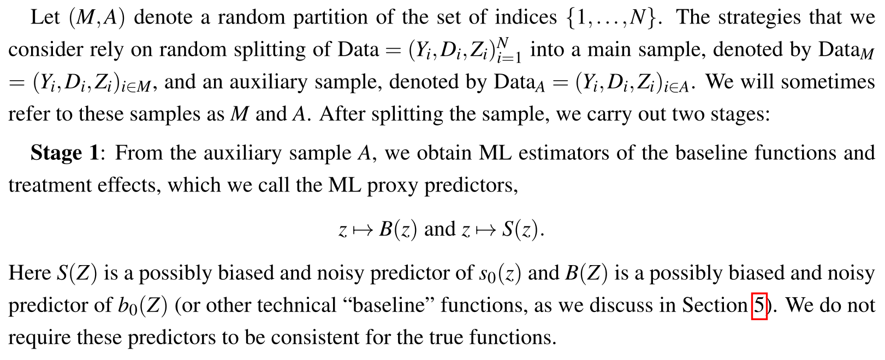
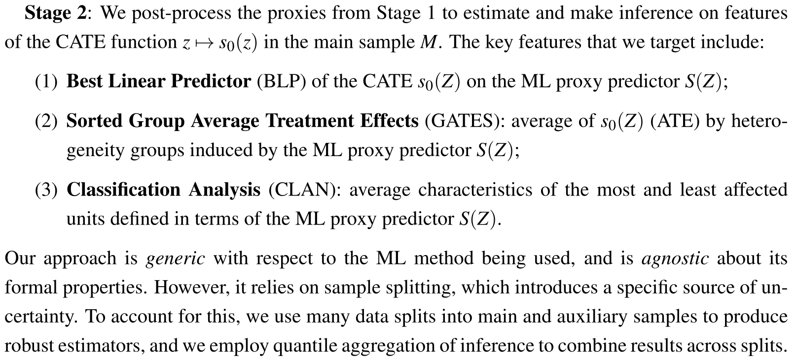
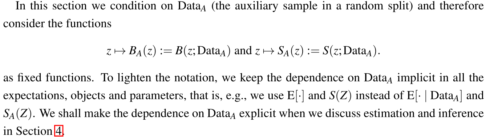
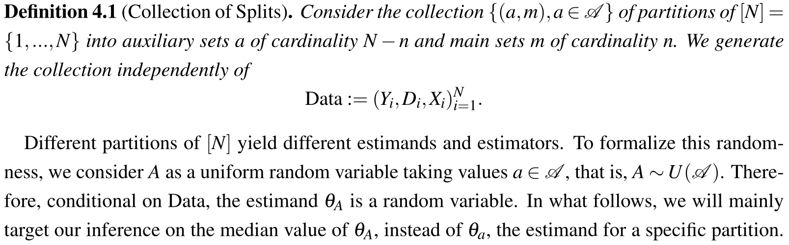
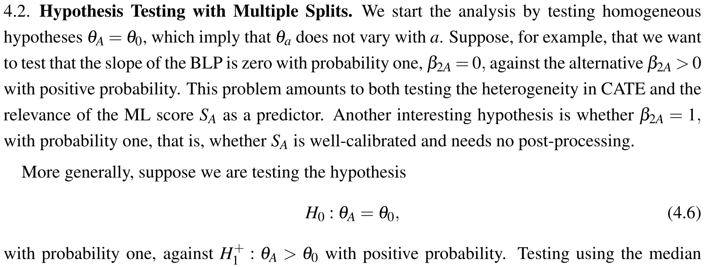
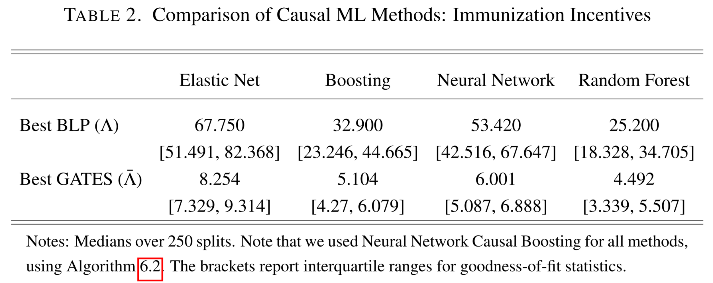
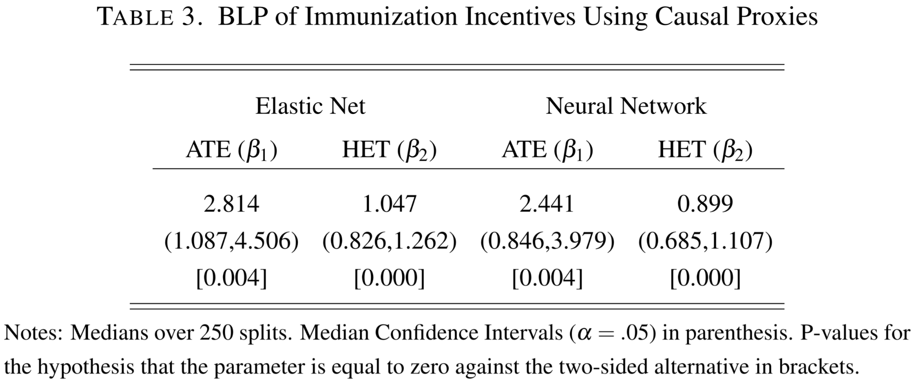
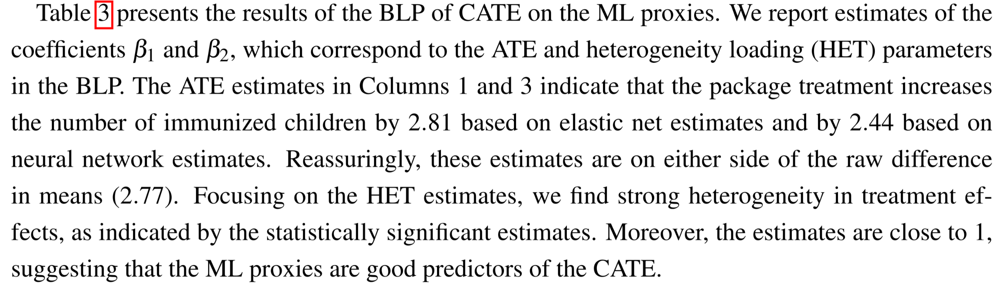

#+TITLE: HTE reading group
# #+Subtitle: by Victor Chernozhukov, Mert Demirer, Esther Duflo, and Iván Fernández-Val
#+Author: Anders Munch
#+Date: \today

* Paper

** Generic machine learning inference on heterogeneous treatment effects in randomized experiments, with an application to immunization in India
by Victor Chernozhukov, Mert Demirer, Esther Duflo, and Iván
Fernández-Val

\hfill

\vfill

775 citations on Google Scholar. 

* Focus

Conceptual focus.

\vfill

Less focus on the actual estimators and the technical requirements for
their validity.

\vfill

More focus on the interpretation of the estimand and null hypotheses
that these estimators targets.

* Major points

Target \textbf{features} of CATE

\vfill

Estimands that depend on machine learning \textbf{proxies} of CATE

\vfill

@@latex:\color{gray}{Insights on best \textbf{approximations} of CATE (in \textbf{RCT}s!)}@@

* Motivation

Investigate/test for heterogeneity of treatment in RCT setting with
high-dimensional covariate vector. Estimation of CATE (or even
low-dimensional features of it) is too hard.

\vfill

**                                                              :B_quotation:
:PROPERTIES:
:BEAMER_env: quotation
:END:

Without some form of sparsity, it is hard, if not impossible, to
obtain consistent estimators of [CATE]. ... One fundamental reason is
that ML methods might not even produce consistent estimators of [CATE]
in high dimensional settings. ... Hence, generic ML estimators cannot
be regarded as consistent, unless further assumptions are
made. Examples of such assumptions include structured forms of linear
and non-linear sparsity and super-smoothness. The problem of obtaining
uniformly valid inference on [CATE] using generic ML methods is even
more difficult.

In this paper, we take an agnostic view. We neither rely on any
sparsity or low-complexity assumptions to make the ML estimators
consistent, nor impose other stronger conditions to make "traditional"
confidence intervals valid. We simply treat ML as providing proxy
predictors for the objects of interest. (p.8)

  
* Some notation and setup

#+begin_export latex
Potential outcomes \( Y(0) \) and \( Y(1) \), binary treatment
indicator \( D \), and high-dimensional covariate vector \( Z \).

\vfill

Main causal functions (identified through standard assumptions) are
\begin{equation*}
  b_0(z)
  =
  {\color{gray}b_P(z)= \;} 
  \E{\left[ Y(0) \mid Z = z \right]}
  = \E{\left[ Y \mid D=0, Z = z \right]}
\end{equation*}
and the CATE function
\begin{equation*}
  s_0(z)
  =
  {\color{gray}s_P(z) = \;} 
  \E{\left[ Y(1) - Y(0)\mid Z = z \right]}
  = \E{\left[ Y(0) \mid Z = z \right]} - \E{\left[ Y \mid D=0, Z = z \right]}
\end{equation*}

\vfill

The propensity score
\begin{equation*}
  p(z) = P(D=1 \mid Z) = P(D=1 \mid Z_1)
\end{equation*}
is \textbf{known}, i.e., RCT setting. 

\vfill

\( B(z) = B_a(z) = B(z; \text{Data}) \) and
\( S(z) = S_a(z) = S(z; \text{Data}) \) denote \textbf{machine
  learning proxies} for \( b_P \) and \( s_P \).
#+end_export

* Stage 1 \small (p.9)

#+ATTR_LATEX: :width 1\textwidth

* Stage 2 \small (p.9)

#+ATTR_LATEX: :width 1\textwidth

* Summary of the proposal

Split data into main and auxiliary samples.

\vfill

- Stage 1 :: Fit complex ML algorithms for estimating \( b_0 \) and \(
  s_0 \) in the auxiliary sample, obtaining the proxies \( B \) and \(
  S \).
\vfill
  
- Stage 2 :: Consider \( B \) and \( S \) as fixed functions and
  estimate some low-dimensional feature of them and the true CATE \( s_0 \)  in
  the main sample.

\vfill

Repeat and base inference on quantiles obtained across different
splits into main and auxiliary samples.

* Conditional (data-adaptive) estimands \small (p.12)

#+ATTR_LATEX: :width 1\textwidth

* Example of feature: Best Linear Prediction (BLP) \small (compare p.12)

** BLP                                                         :B_definition:
:PROPERTIES:
:BEAMER_env: definition
:END:

#+begin_export latex
The best linear predictor of \( s_P(Z) \) by \( S(Z) = s_A(Z) = S(Z ; \text{Data}_A) \) is the
solution to
\begin{equation*}
  \min_{b_1 \in \R, b_2 \in \R} \E_P{\left[ (s_{P}(Z) - b_1 - b_2 S(Z ;
      \text{Data}_A))^2 \mid \text{Data}_A \right]},
\end{equation*}
which, if exists, is defined as
\begin{equation*}
  \text{BLP}_P[s_{P}(Z) \mid S(Z; \text{Data}_A)] := \beta_1 + \beta_2
  (S(Z; \text{Data}_A) 
  -\E_P{\left[ S(Z; \text{Data}_A) \mid \text{Data}_A \right]}),
\end{equation*}
where \( \beta_1 = \E_P{\left[ s_P(Z) \right]} \) and
\( \beta_2 = \text{Cov}_P[s_P(Z), S(Z; \text{Data}_A) \mid
\text{Data}_A]/\text{Var}_P[S(Z; \text{Data}_A) \mid \text{Data}_A]
\).
#+end_export

** 
I write \( s_P = s_0 \) and \( \E_P= \E \) to make it clear that the
"true" expectation \( \E \) means the expectation under \( P \)
according to which the "true" CATE \( s_0 \) is defined.

* Why conditioning on data?

They are discussing \textbf{two} things to address the /"fundamental
impossibilities in non-parametric inference [of CATE estimation]"/
(p.3).

\vfill

- Firstly: :: Target low-dimensional features of CATE, e.g., BLP,
  GATE, CLAN.

\vfill
   
Why not stop here?

#+begin_export latex
\begin{itemize}
\item[$\rightarrow$] Would require that the CATE function can be
  approximated fast enough, typically at a rate which should be \(
  \smallO_P(n^{-1/4}) \).
\item[$\rightarrow$] This is unrealistic in truly high-dimensional settings
(i.e., realistic finite-sample scenario). 
\end{itemize}
#+end_export

\vfill

- Secondly: :: Target low-dimensional features of
  @@latex:\textbf{data-dependent proxies}@@ of CATE and make inference
  \textbf{conditional on data}.

\vfill

*** gray                                        :B_beamercolorbox:
:PROPERTIES:
:BEAMER_env: beamercolorbox
:BEAMER_opt: rounded=true
:END:

\centering Trading unachievable rate-convergence criteria for
post-selection inference interpretations.

* Definition and interpretation of the estimand \small (p.21)

#+ATTR_LATEX: :width 1\textwidth

* Definition and interpretation of the estimand -- my attempt

#+begin_export latex
Define the data-dependent parameter $\theta(P, \text{Data}_a)$ as
\begin{equation*}
  \theta(P; S, \text{Data}_a) = \text{BLP}_P[s_0(Z) \mid S(Z; \text{Data}_a)].
\end{equation*}
The data-dependent ``median'' parameter $\theta_{\text{M}}(P,
\text{Data})$ is defined as
\begin{equation*}
  \theta_{\text{M}}(P; S, \text{Data})
  = \text{Median}(\theta(P; S, \text{Data}_A) \mid \text{Data})
  = \text{Median}_{A \sim U(\mathcal{A})}(\theta(P; S, \text{Data}_A) \mid \text{Data}).
\end{equation*}

\vfill

Would the parameter \( \theta(P; S, \text{Data}) \) be more
interesting? Or  \( \E{[\theta(P; S, \text{Data})]} \)?

\vfill

Would we expect the parameter \( \theta_{\text{M}}(P; \text{Data}) \) to
be close to \( \theta(P; \text{Data}) \) or \( \E{[\theta(P; S, \text{Data})]} \)?

\vfill

Can we relate the interpretation of this to the type of performance measures we get from cross-validation?
#+end_export

* Interpretation of null hypothesis

#+ATTR_LATEX: :width 1\textwidth

* Applied analysis

Immunization (vaccination?) of children i North India (against
measles?).

* Interpretation of results

#+ATTR_LATEX: :width 1\textwidth

* Interpretation of results

#+ATTR_LATEX: :width .7\textwidth

#+ATTR_LATEX: :width .9\textwidth

* Addendum: Best approximation of CATE (in RCTs)

Getting the best approximation of CATE \( s_0 \) based on the proxy \(
S \) is not just OLS -- need to use weight based on the propensity
score.

\vfill

Alternatives for building causal learners of CATE.

\vfill

These tricks only seem to work in an RCT setting(?). So comparison
with existing method, which may be developed for observational
settings, are perhaps not fair. 

* HEADER :noexport:
#+LANGUAGE:  en
#+OPTIONS:   H:1 num:t toc:nil ':t ^:t
#+startup: beamer
#+LaTeX_CLASS: beamer
#+LATEX_CLASS_OPTIONS: [smaller, aspectratio=169]
#+LaTeX_HEADER: \usepackage{natbib, dsfont, pgfpages, tikz,amssymb, amsmath,xcolor}
#+LaTeX_HEADER: \bibliographystyle{abbrvnat}
#+BIBLIOGRAPHY: bib plain

# Beamer settins:
# #+LaTeX_HEADER: \usefonttheme[onlymath]{serif} 
#+LaTeX_HEADER: \setbeamertemplate{footline}[frame number]
#+LaTeX_HEADER: \beamertemplatenavigationsymbolsempty
#+LaTeX_HEADER: \usepackage{appendixnumberbeamer}
#+LaTeX_HEADER: \setbeamercolor{gray}{bg=white!90!black}
#+COLUMNS: %40ITEM %10BEAMER_env(Env) %9BEAMER_envargs(Env Args) %4BEAMER_col(Col) %10BEAMER_extra(Extra)
#+LATEX_HEADER: \setbeamertemplate{itemize items}{$\circ$}

# Matching beamer blue color
#+LaTeX_HEADER: \definecolor{bblue}{rgb}{0.2,0.2,0.7}

# For handout mode: (check order...)
# #+LATEX_CLASS_OPTIONS: [handout]
# #+LaTeX_HEADER: \pgfpagesuselayout{4 on 1}[border shrink=1mm]
# #+LaTeX_HEADER: \pgfpageslogicalpageoptions{1}{border code=\pgfusepath{stroke}}
# #+LaTeX_HEADER: \pgfpageslogicalpageoptions{2}{border code=\pgfusepath{stroke}}
# #+LaTeX_HEADER: \pgfpageslogicalpageoptions{3}{border code=\pgfusepath{stroke}}
# #+LaTeX_HEADER: \pgfpageslogicalpageoptions{4}{border code=\pgfusepath{stroke}}

# Common command
#+LaTeX_HEADER: \newcommand{\E}{{\ensuremath{\mathop{{\mathbb{E}}}}}} 
#+LaTeX_HEADER: \newcommand{\R}{\mathbb{R}}
#+LaTeX_HEADER: \newcommand{\N}{\mathbb{N}}
#+LaTeX_HEADER: \newcommand{\blank}{\makebox[1ex]{\textbf{$\cdot$}}}
#+LaTeX_HEADER: \newcommand\independent{\protect\mathpalette{\protect\independenT}{\perp}}
#+LaTeX_HEADER: \def\independenT#1#2{\mathrel{\rlap{$#1#2$}\mkern2mu{#1#2}}}
#+LaTeX_HEADER: \renewcommand{\phi}{\varphi}
#+LaTeX_HEADER: \renewcommand{\epsilon}{\varepsilon}
#+LaTeX_HEADER: \newcommand*\diff{\mathop{}\!\mathrm{d}}
#+LaTeX_HEADER: \newcommand{\weakly}{\rightsquigarrow}
#+LaTeX_HEADER: \newcommand\smallO{\textit{o}}
#+LaTeX_HEADER: \newcommand\bigO{\textit{O}}
#+LaTeX_HEADER: \newcommand{\midd}{\; \middle|\;}
#+LaTeX_HEADER: \newcommand{\1}{\mathds{1}}
#+LaTeX_HEADER: \usepackage{ifthen} %% Empirical process with default argument
#+LaTeX_HEADER: \newcommand{\G}[2][n]{{\ensuremath{\mathbb{G}_{#1}}{\left[#2\right]}}}
#+LaTeX_HEADER: \DeclareMathOperator*{\argmin}{\arg\!\min}
#+LaTeX_HEADER: \DeclareMathOperator*{\argmax}{\arg\!\max}
#+LaTeX_HEADER: \newcommand{\V}{\mathrm{Var}} % variance
#+LaTeX_HEADER: \newcommand{\eqd}{\stackrel{d}{=}} % equality in distribution
#+LaTeX_HEADER: \newcommand{\arrow}[1]{\xrightarrow{\; {#1} \;}}
#+LaTeX_HEADER: \newcommand{\arrowP}{\xrightarrow{\; P \;}} % convergence in probability
#+LaTeX_HEADER: \newcommand{\KL}{\ensuremath{D_{\mathrm{KL}}}}
#+LaTeX_HEADER: \newcommand{\leb}{\lambda} % the Lebesgue measure
#+LaTeX_HEADER: \DeclareMathOperator{\TT}{\Psi} % target parameter
#+LaTeX_HEADER: \newcommand{\empmeas}{\ensuremath{\mathbb{P}_n}} % empirical measure
